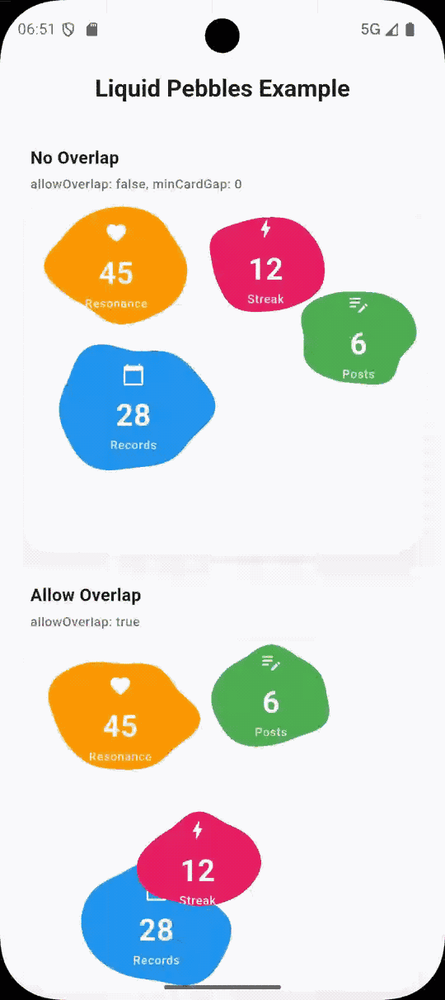

# liquid_pebbles

English | [简体中文](README.md)

`liquid_pebbles` is a pure Flutter UI component library for building immersive "pebble" card containers with slow wandering and continuous morphing effects.

This component visually presents vital characteristics similar to droplets or cells, making it highly suitable for personal center statistics, data overview panels, or the Hero section of a home page. It provides a restrained yet dynamic background for the interface without interfering with the reading of core information. Since it is drawn entirely based on Dart and Flutter, this package has no underlying platform dependencies and can be seamlessly integrated into cross-platform projects.

## Visual Preview



## Core Features

- **Multi-card Display**: Supports accommodating multiple fluid cards in the same area.
- **Independent State Control**: Each card can independently set its initial reference size, docking anchor, and whether it participates in wandering.
- **Multi-dimensional Speed Adjustment**: Supports separating and discretely controlling the speeds of "position drift" and "contour morphing".
- **Collision and Overlap Strategy**: Provides flexible collision boundary detection, allowing precise control of the safe distance between cards via `minCardGap`, or directly enabling an overlap mode that ignores collisions.
- **Organic Shape Generation**: A shape generation algorithm based on harmonic superposition to ensure the contour is constantly changing and will not degenerate into rigid geometric figures.
- **Out of the Box**: Contains no specific business logic or cumbersome resource files; it is a pure typography and visual container.

## Applicable Scenarios

- User data and achievement displays in a personal center.
- Data overview boards for health, psychology, or habit-tracking applications.
- Lightly interactive information areas that need to break traditional grid typography and pursue an organic visual experience.

*(Note: If your business scenario requires strictly aligned grid typography or high-density data presentation, it is recommended to use conventional list or grid components.)*

## Installation Guide

Add the dependency in your project's `pubspec.yaml`:

```yaml
dependencies:
  liquid_pebbles: ^0.0.1
```

Then run in your terminal:

```bash
flutter pub get
```

## Quick Start

Below is minimal integration code showing how to embed this component in a page:

```dart
import 'package:flutter/material.dart';
import 'package:liquid_pebbles/liquid_pebbles.dart';

class DemoSection extends StatelessWidget {
  const DemoSection({super.key});

  @override
  Widget build(BuildContext context) {
    return LiquidPebbles(
      arenaHeight: 300,
      backgroundColor: const Color(0xFFF4F7FB),
      amplitude: 1.2,
      driftSpeedMultiplier: 0.9,
      morphSpeedMultiplier: 1.3,
      minCardGap: 8,
      allowOverlap: false,
      items: const [
        LiquidPebbleItem(
          baseColor: Color(0xFFFF9800),
          size: Size(132, 112),
          child: Center(child: Text('45')),
        ),
        LiquidPebbleItem(
          baseColor: Color(0xFF4CAF50),
          size: Size(112, 96),
          child: Center(child: Text('6')),
        ),
        LiquidPebbleItem(
          baseColor: Color(0xFF2196F3),
          size: Size(144, 120),
          child: Center(child: Text('28')),
        ),
      ],
    );
  }
}
```

## Detailed Parameter Description

### `LiquidPebbles` (Container Layer)

- **`items`**  
  Card data source, accepts a list of `LiquidPebbleItem`.
- **`backgroundColor`**  
  Stage background color. To highlight the liquid texture of the cards, a low-saturation or light-colored background that blends with the page body is recommended.
- **`arenaHeight`**  
  The fixed height of the component. The width defaults to fill the parent constraints.
- **`minCardGap`**  
  Card safe gap. Only effective when `allowOverlap` is `false`. If set to `0`, cards will present a visual state of edges touching.
- **`allowOverlap`**  
  Whether to allow physical overlapping of cards. When enabled, collision detection based on `minCardGap` will be completely ignored.
- **`amplitude`**  
  Deformation amplitude, determining the exaggerated degree of distortion at the edges of the pebbles.
  - `0.8 ~ 1.5`: Presents a faint sense of breathing.
  - `1.5 ~ 3.0`: Significant liquid tension, full of vitality.
  - `3.0+`: Highly distorted, suitable for conceptual or experimental expression.
- **`driftSpeedMultiplier`**  
  Drift speed multiplier, specifically controls the speed of cards colliding and wandering in the stage.
- **`morphSpeedMultiplier`**  
  Morphing speed multiplier, specifically controls the frequency of irregular deformation of card edges.
- **`motionEnabled`**  
  Global animation switch. Setting it to `false` pauses all position movements and shape deformations, commonly used to save performance when the application goes to the background or the page is obscured.
- **`arenaBorderRadius`**  
  The border radius size of the external container of the component.

### `LiquidPebbleItem` (Card Layer)

- **`child`**  
  The business element carried inside the card (such as text, icons).
- **`baseColor`**  
  The base color material of the card.
- **`size`**  
  The baseline physical size of a single card. The component performs non-destructive shape distortion on this reference area at runtime.
- **`anchor`**  
  The docking coordinate during initialization (proportional range `0~1`). If empty, the component will automatically allocate a visually balanced initial booth based on the number of cards.
- **`animatePosition`**  
  Wandering switch. If you want this card to only morph in its original position without displacement, set this to `false`.

## Visual Style Configuration Reference

This component is highly sensitive to parameters. You can adapt the temperament of different applications by fine-tuning various values:

**Restrained and Soothing**  
Suitable for diaries, health, and other application scenarios requiring emotional stability. Cards keep their distance and breathe slowly.
```dart
amplitude: 1.0,
driftSpeedMultiplier: 0.6,
morphSpeedMultiplier: 1.0,
allowOverlap: false,
minCardGap: 8,
```

**Dynamic and Lively**  
Suitable for social, pet, or sports achievement displays. Card deformations are more pronounced and wandering is more frequent.
```dart
amplitude: 1.8,
driftSpeedMultiplier: 1.1,
morphSpeedMultiplier: 1.5,
allowOverlap: false,
minCardGap: 4,
```

**Avant-garde and Deconstructive**  
Allows elements to interleave, presenting strong disordered fluid characteristics at the edges, suitable for strong personalized design expression.
```dart
amplitude: 2.6,
driftSpeedMultiplier: 1.4,
morphSpeedMultiplier: 1.8,
allowOverlap: true,
```

## Engineering Source Code Structure

The core code of the plugin is organized as follows:
- `lib/liquid_pebbles.dart`: Exposed API entry and container-level lifecycle, collision, and redraw scheduling.
- `lib/pebble_node_state.dart`: Handles physical motion tracking, velocity damping, and bounding box collision buffering for a single card.
- `lib/pebble_shape.dart`: Low-level shape calculation engine, utilizing multi-phase harmonics to produce continuous and non-repeating smoothing factors for each frame.
- `lib/pebble_clipper.dart`: Responsible for truly translating the calculated fluid coordinate path into Flutter's Bezier clipping mask.

## Example Project

You can practically experience the physical performance of various parameters by running the `example/` project provided with the plugin. The example project includes two classic demonstrations: separated arrangement and overlapping allowed.

```bash
cd example
flutter run
```
